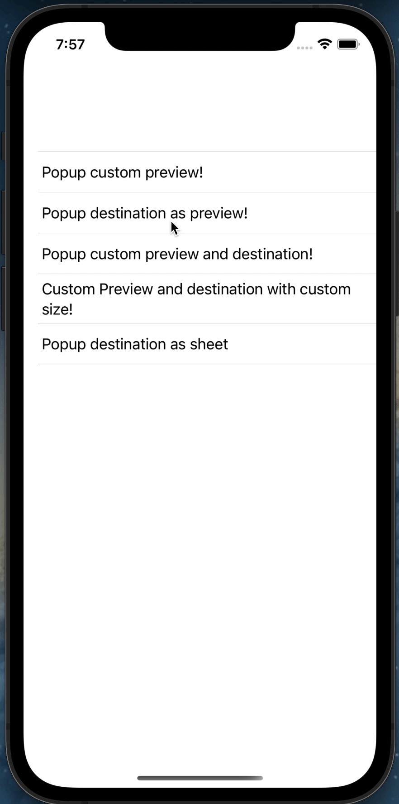
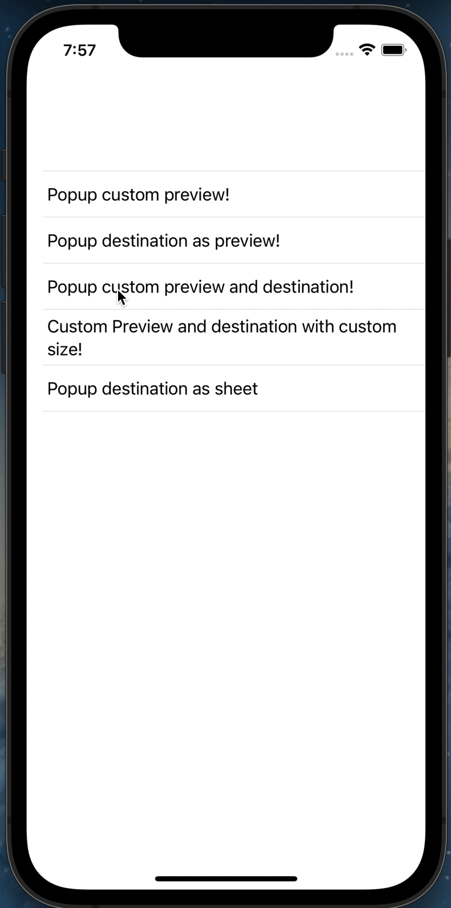
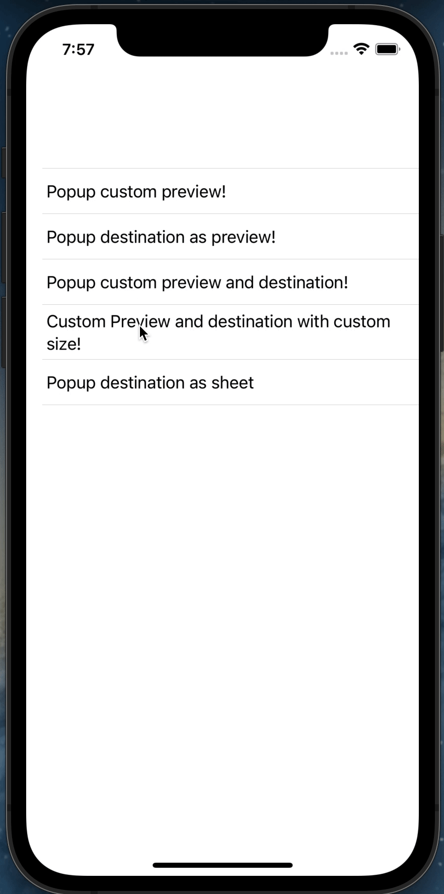

# ContextMenuModifier

Simply convert UIContextMenuInteraction to SwiftUI Modifier

## Usage

import the package in the file you would like to use it: `import ContextMenuModifier`

You can use it as system `.contextMenu` modifier

### Display custom view as context menu preview

<div align="center">
	
</div>

code:

```swift
Text("Popup custom preview!")
    .previewContextMenu(preview: VStack {
        Image(systemName: "face.smiling")
            .font(.largeTitle)
            .foregroundColor(Color(UIColor.systemYellow))
        Text("This is another preview content")
    }, actions: [
        UIAction(title: "Only Title", handler: { _ in }),
        UIAction(title: "Title with image", image: UIImage(systemName: "plus"), handler: { _ in }),
        UIAction(title: "Desctructive action", attributes: .destructive, handler: { _ in })
    ])
```

### Display destination as preview 

<div align="center">
	
</div>

code:

```swift
Text("Popup destination as preview!")
    .previewContextMenu(destination: Text("This is destination view"), actions: [
        UIAction(title: "Only Title", handler: { _ in }),
        UIAction(title: "Title with image", image: UIImage(systemName: "plus"), handler: { _ in }),
        UIAction(title: "Desctructive action", attributes: .destructive, handler: { _ in })
    ])
```

### Custom context preview and destination

<div align="center">
	
</div>

code:

```swift
Text("Popup custom preview and destination!")
    .previewContextMenu(
        destination: Text("This is custom destination view"),
        preview: VStack {
            Image(systemName: "face.smiling")
                .font(.largeTitle)
                .foregroundColor(Color(UIColor.systemYellow))
            Text("This is another preview content")
        },
        actions: [
            UIAction(title: "Only Title", handler: { _ in }),
            UIAction(title: "Title with image", image: UIImage(systemName: "plus"), handler: { _ in }),
            UIAction(title: "Desctructive action", attributes: .destructive, handler: { _ in })
        ]
    )
```

### Custom preferred size for preview 

<div align="center">
	
</div>

```code
Text("Custom Preview and destination with custom size!")
    .previewContextMenu(
        destination: VStack {
            Image(systemName: "face.smiling")
                .font(.largeTitle)
                .foregroundColor(Color(UIColor.systemYellow))
            Text("This is another preview content")
        },
        preview: Text("This is another preview content"),
        preferredContentSize: .init(width: 200, height: 200),
        actions: [
            UIAction(title: "Only Title", handler: { _ in }),
            UIAction(title: "Title with image", image: UIImage(systemName: "plus"), handler: { _ in }),
            UIAction(title: "Desctructive action", attributes: .destructive, handler: { _ in })
        ]
    )
```

### Popup destination view as sheet

<div align="center">
	
</div>

code:

```swift
Text("Popup destination as sheet")
    .previewContextMenu(
        destination: VStack {
            Image(systemName: "face.smiling")
                .font(.largeTitle)
                .foregroundColor(Color(UIColor.systemYellow))
            Text("This is another preview content")
        },
        preview: Text("This is another preview content"),
        presentAsSheet: true,
        actions: [
            UIAction(title: "Only Title", handler: { _ in }),
            UIAction(title: "Title with image", image: UIImage(systemName: "plus"), handler: { _ in }),
            UIAction(title: "Desctructive action", attributes: .destructive, handler: { _ in })
        ]
    )
```
